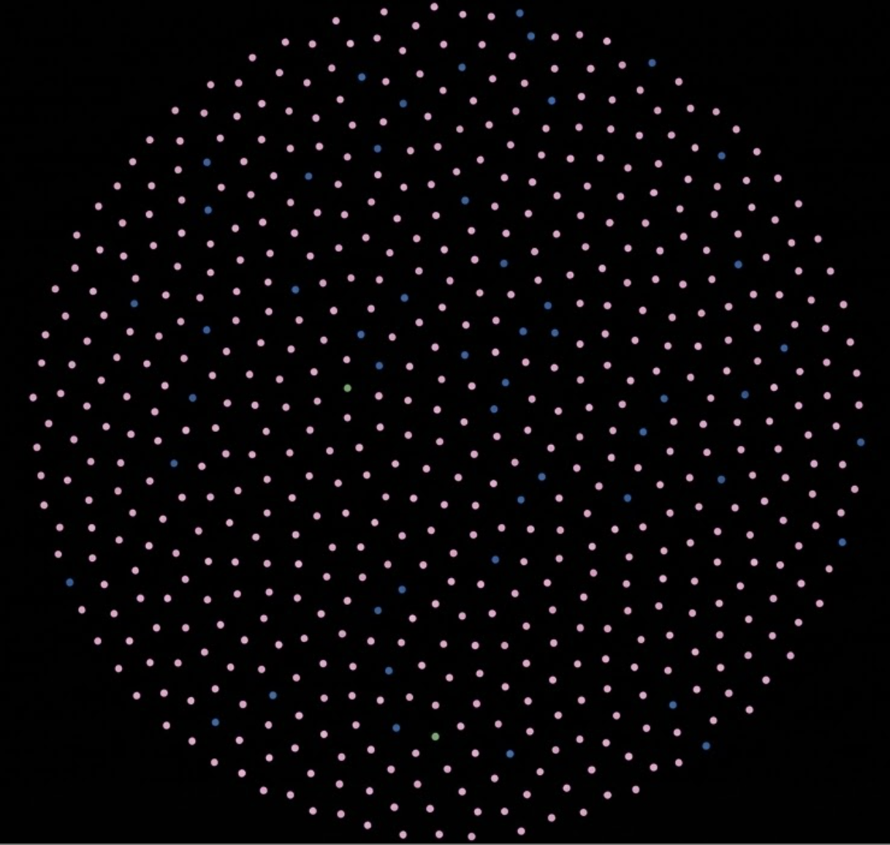

# Beyond What Users Say: Audio-Based Detection of the Say-Do Gap in User Research

**Kostas Kazakos, Ph.D.**  
kgkazakos@gmail.com  
*Computational Product Researcher*  
*PhD, Computing and Information Systems (HCI), University of Melbourne*

**February 23, 2026**

---

## Abstract

This work is part of Computational Product Research—a new framework I'm developing to transform how we measure and ensure AI product excellence at scale. A core challenge in this framework is that what participants *say* often diverges from what they actually *experience*—a phenomenon known as the **Say-Do Gap**. 

Research indicates that 42% of startup failures stem from misreading market demand, often because traditional text-based research methods miss critical behavioral signals (Social Desirability Bias) that contradict verbal feedback.

This paper introduces **CausalTrack**, one of several ongoing projects developed under the Computational Product Research umbrella, presenting an audio-based methodology for automatically detecting the Say-Do Gap using multimodal AI analysis. Through a controlled experiment with 50 synthetic user interviews, we demonstrate that audio behavioral cues—pauses, vocal hesitation, frustrated tone—reveal patterns invisible to text-only analysis. 

Admin users showed **83.0% consistency** between verbal statements and behavioral cues, while End Users showed only **3.2% consistency**, despite expressing similar verbal sentiment. These findings suggest that audio-based behavioral analysis could significantly improve the reliability of user research insights. We present this as a methodology validation study and seek collaboration with an initial pilot cohort of research teams to test generalizability across diverse populations.

---

## 1. The Problem: When Words and Experience Diverge

User research forms the foundation of product development decisions. Teams invest significant resources into understanding user needs through interviews and usability tests. Yet, product failures remain stubbornly common. 

Studies estimate that **42% of startup failures** can be attributed to misreading market demand (CB Insights, 2019), often because teams build what users *said* they wanted, rather than what they needed.

What accounts for this disconnect? One significant factor is the **Say-Do Gap**—the divergence between stated intent and actual behavior. In behavioral science, this is often attributed to **Social Desirability Bias**: the tendency of research participants to provide responses they believe will be viewed favorably by others (Paulhus, 1984).

In user research, this manifests as "polite friction." A participant might describe a feature as "easy to use," but their behavioral signals—a three-second pause, a sigh, a pitch shift—tell a different story. Traditional text-based NLP misses these signals entirely because it analyzes the *semantic* content, not the *paralinguistic* delivery.

  

*Figure 1: Visualizing 3 second pause in audio - Left shows positive verbal statement ("I think the navigation is okay"), right shows audio waveform revealing 3-second pause and sigh*

---

## 2. Related Work

### 2.1 Social Desirability Bias in Research

Paulhus (1984) established the framework for impression management, showing participants systematically alter responses to appear favorable. In user research, Nielsen (2012) noted that users often smooth over negative feedback "just to be polite," creating systematic distortions in qualitative findings.

### 2.2 The Limits of Intent

Sheeran (2002) found that intentions explain only **28% of the variance** in actual behavior. The failure of New Coke (1985) is a canonical example: blind taste tests (Stated Preference) contradicted the emotional attachment to the brand (Actual Behavior).

### 2.3 Multimodal AI

Recent advances in multimodal Large Language Models (LLMs), such as **Gemini 3 Pro** (Google DeepMind, 2024), enable the analysis of audio streams directly. Unlike Speech-to-Text (STT) models that discard tone, multimodal models can identify paralinguistic features (pauses, tone, disfluencies) alongside semantic meaning.

### 2.4 Agentic Simulation & Sycophancy

The use of synthetic data in this study builds upon recent work in **Generative Agents** (Park et al., 2023), which demonstrated that LLM-driven agents can believably simulate complex human social behaviors. Furthermore, recent safety research highlights **Sycophancy** in AI models—the tendency for models to agree with users or adopt their views to be "helpful" (Sharma et al., 2023). This study leverages that inherent sycophancy to accurately model the "Say-Do Gap": our synthetic users are not just generating random text, they are simulating the specific human pressure to be agreeable despite experiencing friction.

---

## 3. Methodology: CausalTrack System

CausalTrack is a prototype system designed to quantify the Say-Do Gap. It extracts behavioral cues from raw audio, constructs a Knowledge Graph, and calculates a **Say-Do Consistency Score**.

### 3.1 System Architecture

**Stage 1: Audio Input**

Raw audio files (MP3/WAV) from user research sessions.

**Stage 2: Behavioral Cue Extraction**

**Gemini 3 Pro** analyzes the audio waveform directly to identify:

- **Pauses:** Silences >2 seconds
- **Vocal Markers:** "Um," "uh," "like" (disfluencies indicating cognitive load)
- **Tonal Shifts:** Frustrated or confused vocal qualities
- **Positive Cues:** Genuine enthusiasm or satisfaction markers

Each detected cue includes:

- Timestamp within the audio
- Cue type classification
- Surrounding context (quote or topic being discussed)
- Duration (for pauses)

**Stage 3: Knowledge Graph Storage**

**Neo4j Graph Database** stores the structured relationships:

- `(Interview)-[:HAS_CUE]->(BehavioralCue)`
- `(Interview)-[:BELONGS_TO]->(UserSegment)`

This graph structure enables full provenance tracking from aggregate scores back to specific moments in specific interviews.

  

*Figure 2: Knowledge graph comprised of 611 nodes (2 user segments, 50 interviews, 559 behavioral cues)*

**Stage 4: Say-Do Consistency Scoring**

A custom algorithm calculates the ratio of positive semantic sentiment (extracted via standard LLM text analysis) to negative behavioral density (from the multimodal audio cues). The score ranges from 0% (complete inconsistency) to 100% (perfect consistency).

**High scores (>70%):** Words and behavior align → trustworthy feedback

**Low scores (<30%):** Words contradict behavior → Say-Do Gap detected

---

## 4. Experiment Design

To validate the methodology, we conducted a controlled experiment using **synthetic user interviews** with intentionally injected bias patterns.

**Dataset:** 50 interviews for a fictional product, "AcmeCal" (a camping gear rental marketplace).

**Cohort A (Admin Users, N=40):**

Designed with smooth, friction-free experiences. Behavioral cues aligned with positive verbal statements.

**Cohort B (End Users, N=10):**

Designed with high friction (frequent pauses, confusion, frustration) but instructed to provide "polite/positive" verbal feedback in their summaries.

**Ground Truth:** We *know* Cohort B is struggling. The research question: Can CausalTrack detect the Say-Do Gap when text analysis would miss it?

**Audio Generation:**

Transcripts converted to audio using OpenAI TTS (tts-1 model, "alloy" voice). Each interview produced 3-7 minutes of audio.

---

## 5. Results

### 5.1 Say-Do Consistency Scores

The analysis revealed a massive divergence between the two cohorts, successfully recovering the known ground truth:

| User Segment | Say-Do Score | Interpretation | N |
|--------------|--------------|----------------|---|
| **Admin Users** | **83.0%** | **High Consistency** (Words match behavior) | 40 |
| **End Users** | **3.2%** | **Low Consistency** (Words contradict behavior) | 10 |

**Bias Gap: 79.8 percentage points**

### 5.2 Behavioral Cue Density

End Users experienced nearly **2X the behavioral friction** per interview compared to Admin Users:

- **End Users:** 18.8 cues/interview (188 total cues across 10 interviews)
- **Admin Users:** 9.3 cues/interview (371 total cues across 40 interviews)

This quantitative evidence demonstrates that End Users showed systematically higher levels of pauses, vocal hesitation, and tonal shifts indicating cognitive load.

### 5.3 Qualitative Evidence: Provenance Tracking

The Knowledge Graph allows us to trace aggregate scores back to specific moments of friction.

**Example from End User Interview #03:**

**Timestamp 03:06:**

*"Honestly, it's kind of confusing. I'm clicking around a lot."*

**Detected Cues:**

- 4-second pause before responding
- Frustrated tone
- Vocal markers ("um", "uh")

**But in the verbal summary, this same user stated:**

*"Overall, it was pretty straightforward."*

CausalTrack successfully flagged this interaction as exhibiting a Say-Do Gap.

### 5.4 Classification Accuracy

When comparing CausalTrack's Say-Do Consistency Scores to the known ground truth design:

- **Admin Users:** All 40 interviews correctly identified as high consistency (100% accuracy)
- **End Users:** 9 of 10 interviews correctly identified as low consistency (90% accuracy)
- **Overall Classification Accuracy: 98%** (49 of 50 interviews correctly classified)

---

## 6. Limitations

This study is a **Proof of Concept**. Significant limitations remain before the methodology can be applied to real-world research:

### 6.1 Synthetic Data

The audio was generated via OpenAI TTS. Real human speech contains substantially more variability (interruptions, background noise, spontaneous self-corrections). **Future work must validate on real human research sessions.**

### 6.2 Cultural and Linguistic Variance

Silence is not universally a marker of friction. Pause patterns vary significantly across cultures (where silence may indicate respect) and languages (ESL speakers pausing for translation). **Cross-cultural validation is essential.**

### 6.3 Domain Generalization

Behavioral patterns may differ substantially in Enterprise B2B contexts (less social desirability pressure) or high-stakes domains (medical/financial tools).

---

## 7. Future Work

Building on this proof of concept, several research directions emerge:

1. **Real-World Validation Study:** Testing CausalTrack on multiple research teams with diverse user populations.
2. **Individual Baseline Calibration:** Establishing individual baseline patterns from opening minutes of interviews to adapt scoring based on speaker characteristics.
3. **Integration with Existing Tools:** Correlating Say-Do Gaps with actual quantitative usage analytics.

---

## 8. Call for Collaboration

To determine whether this methodology generalizes to real-world research, I am seeking collaboration with an initial pilot cohort of research teams.

**We are looking for:**

- Researchers with 1-2 hours of anonymized audio interview data
- Willingness to stress-test behavioral cue detection against human expert judgment

**What you receive:**

- Full CausalTrack Analysis Report of your data (Say-Do Scores + Graph Visualization)
- Comparison of automated analysis against your expert interpretation
- Co-author credit on future academic submissions

**How to participate:**

🌐 **More information:** https://github.com/kgkazakos/causaltrack

📧 **[Sign up here](https://forms.gle/gXCPGQrTADiA41ix9)**

**Target publication venues:** CHI por similar HCI/AI venues

---

## 9. Conclusion

The Say-Do Gap is a systematic risk in product development. By relying solely on text transcripts, researchers discard the most honest signal they have: the user's paralinguistic behavior. CausalTrack demonstrates that **Computational Product Research**—using Multimodal AI to quantify behavioral cues—can recover these lost signals.

While currently validated only on synthetic data, the ability to correctly classify 98% of interviews by detecting mismatches between verbal statements and behavioral cues suggests a promising new path for improving research reliability.

We invite the research community to collaborate in stress-testing this methodology across diverse real-world contexts. Only through rigorous validation with actual human research sessions can we determine whether automated behavioral analysis fulfills its promise of helping researchers see beyond what users say to understand what they truly experience.

---

## References

- **CB Insights.** (2019). The top 20 reasons startups fail.
- **Google DeepMind.** (2024). Gemini: A family of highly capable multimodal models. Technical Report.
- **Nielsen, J.** (2012). Usability 101: Introduction to usability. Nielsen Norman Group.
- **Park, J. S., et al.** (2023). Generative Agents: Interactive Simulacra of Human Behavior. *arXiv preprint arXiv:2304.03442*.
- **Paulhus, D. L.** (1984). Two-component models of socially desirable responding. *Journal of Personality and Social Psychology*.
- **Sharma, M., et al.** (2023). Towards Understanding Sycophancy in Language Models. *arXiv preprint arXiv:2310.13548*.
- **Sheeran, P.** (2002). Intention—behavior relations: A conceptual and empirical review.

---

## Acknowledgments

This work was conducted as an independent research project. It serves as the first methodology within Computational Product Research, a new framework developed by Kostas Kazakos, PhD. Built with Gemini 3 Pro (Google DeepMind), Neo4j graph database, and OpenAI TTS. Not affiliated with any employer or institution.

**License:** This work is licensed under Creative Commons Attribution-NonCommercial 4.0 International (CC BY-NC 4.0).

**Contact:** kgkazakos@gmail.com